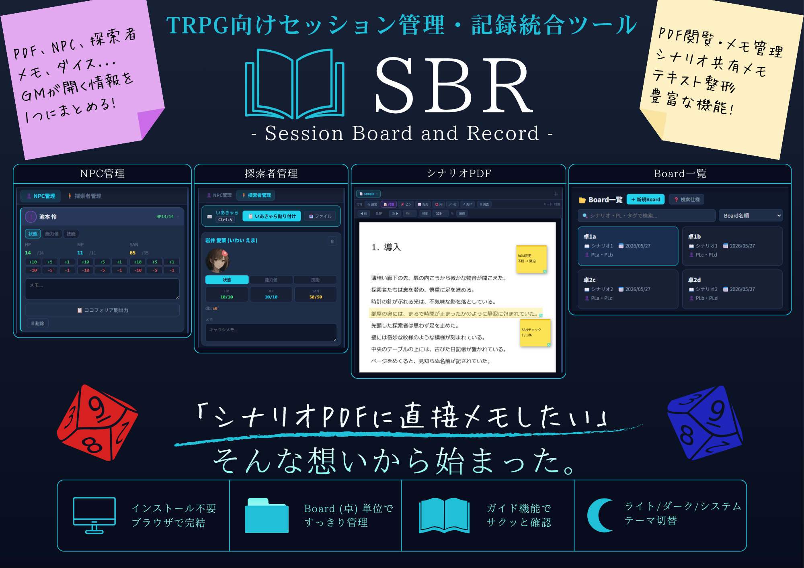

<p align="center">
  
</p>

# 📖 SBR - Session Board and Record -

TRPG（主にクトゥルフ神話TRPG）セッションの準備・進行・記録をひとつの画面でまとめて行うための、ブラウザ単体で動作するセッション管理ツールです。

インストール不要で、`SBR.html` をブラウザで開くだけで使用できます。データはすべて端末内（localStorage / IndexedDB）に保存され、外部サーバーへの送信は行いません。

## 特徴

- PDFシナリオビューア＋付箋・注釈機能
- NPC管理（HP / MP / SANなど）
- 探索者（PC）管理
- Board（卓）ごとのセッション記録・メモ
- ダイス・コマンド生成、対抗ロール計算、オリジナル表
- ココフォリアログの読み込み・検索
- テキスト整形（PDFコピペ文章の改行崩れ修正）

## 使い方

1. 右上の **Code → Download ZIP** からこのリポジトリをまるごとダウンロード
2. 好きな場所に展開（解凍）
3. 展開したフォルダ内の `SBR.html` を、ブラウザ（Google Chrome推奨。Microsoft Edge / Firefoxでも動作確認済み）でダブルクリックして開く

詳しい使い方は [SBR_使い方マニュアル.html](manual/SBR_使い方マニュアル.html) を参照してください。

## 動作環境

- OS: Windows / macOS
- ブラウザ: Google Chrome, Microsoft Edge, Firefox（動作確認済み。Safariでの動作確認は行っていません）

## フォルダ構成

```text
SBR/
├── SBR.html                          # 本体（このファイルを開くだけで動作）
├── manual/
│   ├── SBR_使い方マニュアル.html      # 使い方マニュアル
│   └── images/                       # マニュアル掲載用の画像
├── docs/
│   └── sbr_session_board_and_record_specification.md  # 設計仕様書
└── assets/
    ├── icon/SBR_icon.svg             # アイコン
    └── SBR_banner.png                # 紹介バナー
```

## 利用条件

個人利用・セッションでの利用は可能ですが、再配布・転載は禁止されています。詳細は[マニュアル内の利用規約](manual/SBR_使い方マニュアル.html#terms)を参照してください。

## 開発

- 開発：夢生ツムグ
- 協力：ChatGPT・Claude.AI
